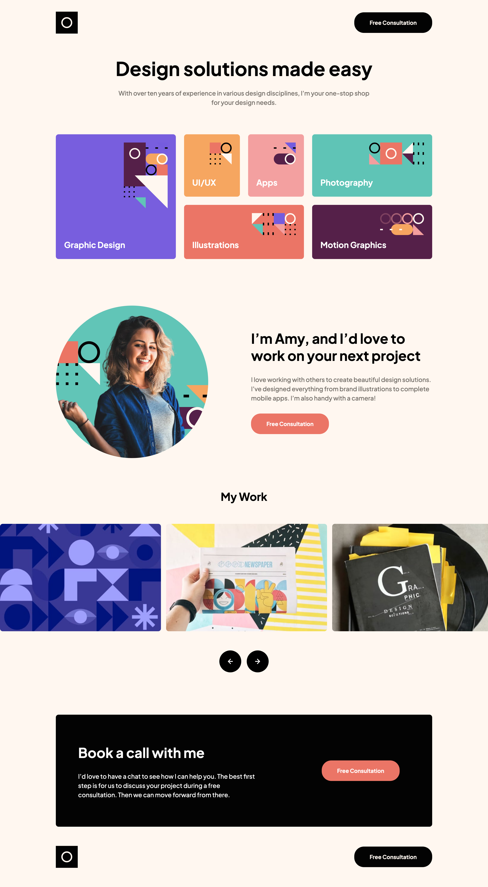

# Frontend Mentor - Single-page design portfolio solution

This is a solution to the [Single-page design portfolio challenge on Frontend Mentor](https://www.frontendmentor.io/challenges/singlepage-design-portfolio-2MMhyhfKVo). Frontend Mentor challenges help you improve your coding skills by building realistic projects.

## Table of contents

- [Overview](#overview)
  - [The challenge](#the-challenge)
  - [Screenshot](#screenshot)
  - [Links](#links)
- [My process](#my-process)
  - [Built with](#built-with)
  - [What I learned](#what-i-learned)
  - [Useful resources](#useful-resources)

## Overview

### The challenge


### Screenshot



### Links


## My process

### Built with

- CSS custom properties
- Flexbox
- CSS Grid
- Mobile-first workflow
- React - JS library

### What I learned


To see how you can add code snippets, see below:

```css
.swiper-button-prev,
.swiper-button-next {
	position: static;
	width: 6.4rem !important;
	height: 6.4rem;
	display: inline-block !important;
	margin-top: 3.2rem;
	background-repeat: no-repeat;
	background-color: black;
	background-position: center;
	border-radius: 50%;
	cursor: pointer;
	transition: background-color 0.4s;
}
```)
